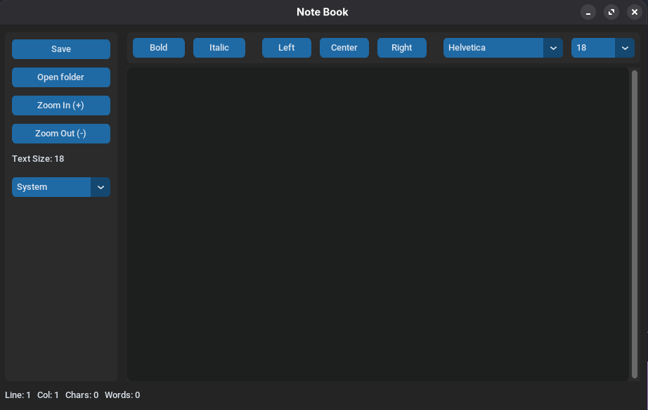

# Note Book

A modern desktop text editor built with Python + CustomTkinter.

## Features

- Open and save files quickly
- Supports `.txt`, `.py`, `.c`, `.html`, `.css`, `.js`
- Top formatting toolbar with:
  - Bold
  - Italic
  - Text alignment (Left, Center, Right)
  - Font family selector
  - Font size selector
- Font behavior for writing flow:
  - Existing text keeps its current font style
  - Newly typed text uses the newly selected font family/size
- Theme switcher: Light / Dark / System
- Live status bar with line, column, character count, and word count
- Zoom controls with limits (`Ctrl + +`, `Ctrl + -`, and `Ctrl + mouse scroll`)
- Keyboard shortcuts for formatting (`Ctrl + B`, `Ctrl + I`)
- Responsive editor layout
- Custom app name and icon

## Requirements

- Python 3
- `customtkinter`
- Tkinter (normally included with Python)

Install dependency:

```bash
python3 -m pip install customtkinter
```

## Run

```bash
python3 "main(notebook).py"
```

## Usage

1. Click **Open folder** to open a file.
2. Edit content in the text area.
3. Use the top toolbar for bold, italic, alignment, font family, and font size.
4. Click **Save** to save changes.
5. Use zoom controls when needed.
6. Use mode selector to switch theme.

## Manual Linux Build

```bash
chmod +x build_linux.sh
./build_linux.sh
```

Build output:

- `dist/NoteBook` (Linux executable)
- `dist/NoteBook.desktop` (desktop launcher)

Optional: add launcher to app menu

```bash
cp dist/NoteBook.desktop ~/.local/share/applications/notebook.desktop
chmod +x ~/.local/share/applications/notebook.desktop
update-desktop-database ~/.local/share/applications 2>/dev/null || true
```
Note Book Icon: 


Note Book Preview:

