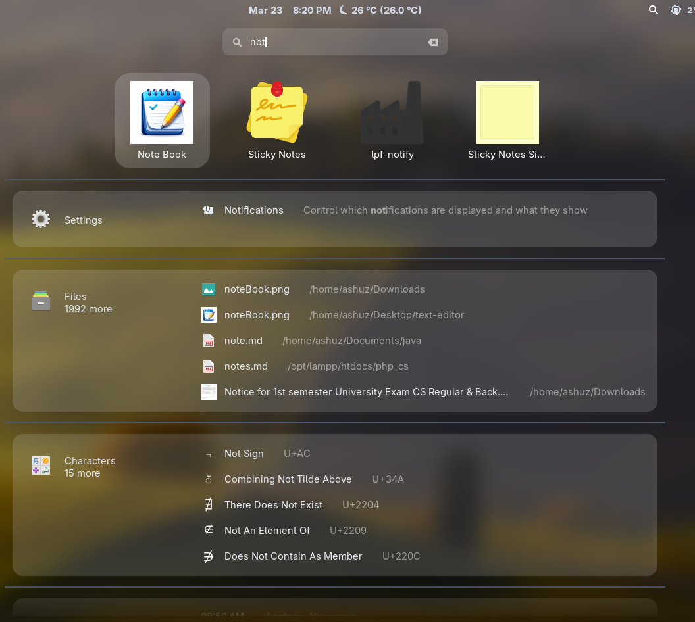
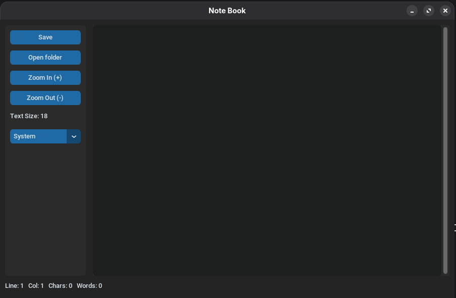

# Note Book

A modern desktop text editor built with Python + CustomTkinter.

## Features

- Open and save files easily
- Supports: `.txt`, `.py`, `.c`, `.html`, `.css`, `.js`
- Dark / Light / System theme mode switch
- Live status bar:
	- current line
	- current column
	- character count
	- word count
- Text zoom controls (with limits):
	- Zoom In / Zoom Out buttons
	- Keyboard shortcuts (`Ctrl` + `+`, `Ctrl` + `-`)
	- Mouse zoom (`Ctrl` + scroll)
- Responsive layout for resize/maximize
- Custom app name: **Note Book**
- Custom icon support (`noteBook.png`)

## Requirements

- Python 3
- `customtkinter`
- Tkinter (normally included with Python)

Install dependency:

```bash
python3 -m pip install customtkinter
```

## Run

```bash
python3 "main(notebook).py"
```

## Usage

1. Click **Open folder** to open a file.
2. Edit content in the text area.
3. Click **Save** to save changes.
4. Use zoom controls when needed.
5. Use mode selector to switch theme.

## Manual Linux Build

```bash
chmod +x build_linux.sh
./build_linux.sh
```

Build output:

- `dist/NoteBook` (Linux executable)
- `dist/NoteBook.desktop` (desktop launcher)

Optional: add launcher to app menu

```bash
cp dist/NoteBook.desktop ~/.local/share/applications/notebook.desktop
chmod +x ~/.local/share/applications/notebook.desktop
update-desktop-database ~/.local/share/applications 2>/dev/null || true
```




